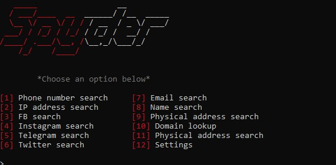

# Spyder🕷
**Spyder is a universal open-source intelligence (OSINT) research tool that performs searches using large global databases.**
#
[](https://t.me/+pB6j65Kv7cdjZmU0)
# 
<h1 align="center">
  
</h1>

# Features
1. Phone number information
2. IP address information
3. Socials(Facebook, Instagram, Telegram, Twitter) information
4. Email information & Email bomber
5. Person's name search
6. Physical address information
7. Domain lookup
8. License plate information(EU, Asia)
9. Username search

# Requirements
- Python 3.10
- Pip
- Git

##**A note for Windows and macOS users:** 
If you're installing on Windows or Linux, see below; macOS users get the [DMG file](../../releases).  


Verify the installation of Git & Python.

https://git-scm.com/install/windows

https://www.python.org/ftp/python/3.13.12/python-3.13.12-amd64.exe

Start cmd with administrative access.


# Installation🍃(WINDOWS)
```shell
git clone https://github.com/tq17oa7/spyder-osint
cd spyder-osint
run.bat
```
**OR**
```shell
git clone https://github.com/tq17oa7/spyder-osint
cd spyder-osint
py -m pip install -r requirements.txt
py spyder.py
```
# Installation🍃(LINUX)
```shell
sudo apt install python3 python3-pip -y
git clone https://github.com/tq17oa7/spyder-osint
cd spyder-osint
pip3 install -r requirements.txt
chmod +x run.sh
./run.sh 
```

# Contribution🌟
- ***REPORT BUGS TO MY [TELEGRAM](https://t.me/+9j5RcKMfT5s4M2Q0)***
- ***Don't forget to put stars, it supports me a lot⭐***